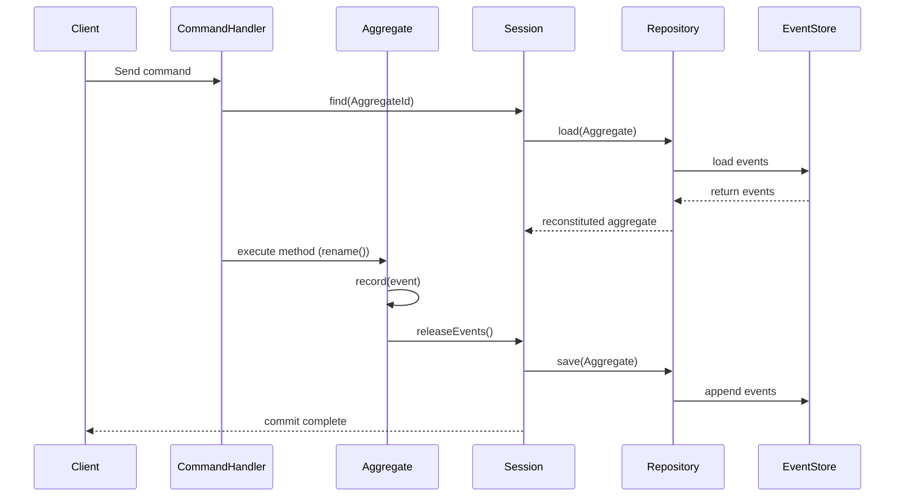

# 🧠 Pillar

### Elegant Domain-Driven Design & Event Sourcing for Laravel

**Pillar** is a modern, opinionated framework for building **rich domain models** and **event-sourced systems** in
Laravel — without the complexity.

It brings the power of **Domain-Driven Design (DDD)** and **Event Sourcing** to PHP through expressive abstractions and
seamless Laravel integration.

Pillar provides all the essential building blocks for highly maintainable, auditable, and testable applications — so you
can focus on your domain, without being constrained by rigid conventions or framework-imposed structure.

---

## ✨ Features

- ⚙️ **Aggregate roots and repositories** for event-sourced and non-event-sourced aggregates
- 🧩 **Command and Query Buses** with Laravel facade support
  🧠 **Aggregate sessions** act as a Unit of Work, tracking loaded aggregates and automatically persisting their changes
  and emitted events.
- 🗃️ **Event store abstraction** with database-backed default implementation
- 🔁 **Event replay** command for rebuilding projections
- 🧬 **Event Upcasters** for schema evolution and backward compatibility
- 💾 **Snapshotting** with configurable store
- 🪶 **Serializer abstraction** (default: JSON)
- 🔧 **Laravel integration** via `PillarServiceProvider`
- ⚙️ Configurable **repository and event store implementations**

---

## 🧩 Installation

```bash
composer require edvin/pillar
```

Pillar automatically registers its service provider via Laravel package discovery.

---

## ⚙️ Installing Pillar

After requiring the package via Composer, run the installer to set up migrations and configuration:

```bash
php artisan pillar:install
```

This is an interactive installer that asks whether to publish the events migration and config file.

You’ll be prompted to:

- Publish the **events table migration** (for event sourcing)
- Publish the **configuration file** (`config/pillar.php`)

Once published, run:

```bash
php artisan migrate
```

to create the `events` table in your database.

---

### 📁 Published files

| File                                                            | Description                                                                     |
|-----------------------------------------------------------------|---------------------------------------------------------------------------------|
| `database/migrations/YYYY_MM_DD_HHMMSS_create_events_table.php` | The table used to store domain events                                           |
| `config/pillar.php`                                             | Global configuration for repositories, event store, serializer and snapshotting |

---

## 🧠 Aggregate Sessions

Command handlers use the **AggregateSession** to load and persist aggregates.

The session tracks all loaded aggregates, captures emitted events, and commits them atomically at the end of the
command.

```php
use Pillar\Aggregate\AggregateSession;
use Context\Document\Domain\Identifier\DocumentId;
use Context\Document\Application\Command\RenameDocumentCommand;

final class RenameDocumentHandler
{
    public function __construct(private AggregateSession $session) {}

    public function __invoke(RenameDocumentCommand $command): void
    {
        $document = $this->session->find(DocumentId::from($command->id));
        $document->rename($command->newTitle);
        $this->session->commit();
    }
}
```

This pattern ensures that all domain changes occur within a controlled *unit of work* —
capturing emitted events, maintaining consistency, and persisting all changes in a single transaction.

---

## 🗃️ Event Store

The event store is pluggable. The default `DatabaseEventStore` persists domain events in a database table.
Custom stores (e.g. Kafka, DynamoDB, etc.) can be registered by implementing the `EventStore` interface.

```php
interface EventStore
{
    public function append(AggregateRootId $id, object $event): int;
    public function load(AggregateRootId $id, int $afterSequence = 0): array;
    public function exists(AggregateRootId $id): bool;
}
```

## ⚡ Ephemeral Events

Not every domain event needs to be stored permanently.  
Some events represent **transient domain signals** — things that should be dispatched in real time but never recorded in
the event store. For these cases, Pillar provides the `EphemeralEvent` marker interface:

```php
use Pillar\Event\EphemeralEvent;

final class TemporaryCacheInvalidated implements EphemeralEvent
{
    public function __construct(
        public string $cacheKey
    ) {}
}
```

Any event implementing `EphemeralEvent` will be **dispatched normally** (to listeners, handlers, and projectors)  
but **excluded from persistence** in the event store. This is useful for:

- Events that only trigger external processes (like cache invalidation or notifications)
- Integration events that are transient and not part of aggregate history
- Temporary or internal system events that don’t represent durable business facts

This keeps your event streams clean, containing only domain events that truly represent **state changes**.

## 🧩 Context Registries

A **ContextRegistry** acts as a central place to register and organize the commands, queries, and events belonging to a
bounded context. It helps structure your application by grouping related domain logic and event handling in one place.

A ContextRegistry typically defines:

- The **name** of the context
- The **commands** handled within the context
- The **queries** supported by the context
- The **events** produced, along with their listeners and optional aliases

This registration enables Pillar to automatically wire up command and query buses, event dispatching, and alias
management across your application.

### Example ContextRegistry

```php
use Pillar\Context\ContextRegistry;
use Pillar\Context\EventMapBuilder;

final class DocumentContextRegistry implements ContextRegistry
{
    public function name(): string
    {
        return 'document';
    }

    public function commands(): array
    {
        return [
            CreateDocumentCommand::class,
            RenameDocumentCommand::class,
        ];
    }

    public function queries(): array
    {
        return [
            FindDocumentQuery::class,
        ];
    }

    public function events(): EventMapBuilder
    {
        return EventMapBuilder::create()
            ->event(DocumentCreated::class)
                ->alias('document_created')
                ->upcasters([DocumentCreatedV1ToV2Upcaster::class])
                ->listeners([DocumentCreatedProjector::class])
            ->event(DocumentRenamed::class)
                ->alias('document_renamed')
                ->listeners([DocumentRenamedProjector::class]);
    }
}
```

🧰 Registering Context Registries

Each ContextRegistry must be registered in your application’s `config/pillar.php` file under the contexts key:

```php
'contexts' => [
    \Context\DocumentHandling\Application\DocumentContextRegistry::class,
    \Context\UserManagement\Application\UserContextRegistry::class,
],
```

---

## 🎭 Event Aliases

Pillar supports mapping **event classes to short aliases** to make stored event names more readable and stable over
time.

Event aliases are defined in your `ContextRegistry` using the `EventMapBuilder`.  
This allows each bounded context to declare its own aliases alongside its event listeners:

```php
public function events(): EventMapBuilder
{
    return EventMapBuilder::create()
        ->event(DocumentCreated::class)
            ->alias('document_created')
            ->listeners([DocumentCreatedProjector::class])
        ->event(DocumentRevised::class)
            ->alias('document_revised')
            ->listeners([DocumentRevisedProjector::class]);
}
```

During serialization, the alias will be stored in the event store instead of the full class name.  
When loading events, both the alias **and** the original class name are supported — ensuring **backward compatibility**
with existing event streams.

Event aliases are automatically registered through the `ContextRegistry` during application boot,  
and managed globally by the `EventAliasRegistry`, which is used internally by the `DatabaseEventStore`.

### ✅ Benefits

- Shorter, human-readable event names in your database
- Backward compatibility for renamed or refactored event classes
- Centralized alias management across contexts

---

### ⚠️ Avoiding Alias Collisions

Aliases must be **globally unique** because all events share a single alias registry. If two different events (even from
different bounded contexts) use the same alias, it can cause deserialization of the wrong event type, leading to subtle
and hard-to-debug errors.

To prevent collisions, always **prefix your aliases with your context name** or another unique namespace. For example:

- `document.created`
- `billing.invoice_issued`
- `user.password_reset`

This namespacing convention ensures that even if multiple contexts define events with similar names (like `created`),
their aliases remain distinct and unambiguous.

Using fully qualified, namespaced aliases helps maintain the integrity and readability of your event store across all
bounded contexts.

---

## 🧬 Event Upcasters

**Upcasters** allow you to evolve event schemas over time while keeping your historical event data valid.  
They transform old event payloads into their latest structure during deserialization — before your aggregates or
projectors ever see them.

This makes it safe to refactor your events or add new fields without rewriting your event store.

### Example

```php
use Pillar\Event\Upcaster;

final class DocumentCreatedV1ToV2Upcaster implements Upcaster
{
    public static function eventClass(): string
    {
        return DocumentCreated::class;
    }

    public static function fromVersion(): int
    {
        return 1; // upgrades v1 -> v2
    }

    public function upcast(array $payload): array
    {
        // Older events lacked a "created_by" field — set a default.
        $payload['created_by'] ??= 'system';
        return $payload;
    }
}
```

### Registration

Each upcaster is registered in its `ContextRegistry` using the `EventMapBuilder`:

```php
public function events(): EventMapBuilder
{
    return EventMapBuilder::create()
        ->event(DocumentCreated::class)
            ->alias('document_created')
            ->listeners([DocumentCreatedProjector::class])
            ->upcasters([DocumentCreatedV1ToV2Upcaster::class]);
}
```

### How It Works

- Upcasters are registered globally in the **UpcasterRegistry** during application boot via the `ContextLoader`.
- When events are loaded from the event store, Pillar checks the stored event version and the current version declared
  by the event (see “Versioned Events” below).
- If the stored version is lower, Pillar applies upcasters sequentially (v1 → v2 → v3 → …) until the payload matches the
  current version.
- Each upcaster declares the event class it handles and the version it upgrades from via `fromVersion()`.

---

### ✅ Benefits

- Seamless **schema evolution** for persisted events
- Fully **backward compatible** without modifying existing data
- **Composable transformations** — multiple upcasters can chain together
- Zero impact on aggregate or projector code

---

### ⚡ Optimized Serialization

Pillar’s default `JsonObjectSerializer` automatically converts objects to and from JSON,
using PHP reflection to reconstruct event and command objects during deserialization.

To ensure high performance, **constructor parameter metadata is cached per class**.
This avoids repeated reflection calls on hot paths, making event and command deserialization
fast even at large scales.

You can provide your own serializer by implementing the `ObjectSerializer` interface —
for example, to integrate a binary format or custom encoding strategy.

---

### 🧩 Versioned Events

Pillar supports **versioned domain events** to make schema evolution explicit and safe.

Implement `VersionedEvent` on your event and declare its current schema version:

```php
use Pillar\Event\VersionedEvent;

final class DocumentCreated implements VersionedEvent
{
    public static function version(): int
    {
        return 2;
    }

    public function __construct(
        public string $title,
        public string $created_by
    ) {}
}
```

- The event’s version is stored in the event store (`event_version` column) alongside its payload.
- On load, if a stored event has an **older version**, Pillar applies registered upcasters step-by-step until the
  payload reaches the event’s current version.
- You can register **multiple upcasters** for the same event (e.g. v1→v2, v2→v3). They are applied in ascending order of
  `fromVersion()`.

**Tip:** If you refactor an event without changing its shape, you can simply bump the version and register a no-op
upcaster for documentation clarity.

---

## 🧩 Aggregate Roots

Aggregates are the **core building blocks** of your domain model — they encapsulate state and enforce invariants through event-driven or state-driven updates.

In Pillar, all aggregates extend the abstract base class `AggregateRoot`, which provides a consistent pattern for **recording and applying domain events**, while still allowing simpler state-backed persistence when full event sourcing isn’t needed.

---

### Example (Event-Sourced Aggregate)

```php
use Pillar\Aggregate\AggregateRoot;
use Context\Document\Domain\Event\DocumentCreated;
use Context\Document\Domain\Event\DocumentRenamed;
use Context\Document\Domain\Identifier\DocumentId;

final class Document extends AggregateRoot
{
    private DocumentId $id;
    private string $title;

    public static function create(DocumentId $id, string $title): self
    {
        $self = new self();
        $self->record(new DocumentCreated($id, $title));
        return $self;
    }

    public function rename(string $newTitle): void
    {
        if ($this->title === $newTitle) {
            return;
        }

        $this->record(new DocumentRenamed($this->id(), $newTitle));
    }

    protected function applyDocumentCreated(DocumentCreated $event): void
    {
        $this->id = $event->id;
        $this->title = $event->title;
    }

    protected function applyDocumentRenamed(DocumentRenamed $event): void
    {
        $this->title = $event->newTitle;
    }

    public static function fromSnapshot(array $data): self
    {
        $self = new self();
        $self->id = DocumentId::from($data['id']);
        $self->title = $data['title'];
        return $self;
    }

    public function id(): DocumentId
    {
        return $this->id;
    }
}
```

This is the **event-sourced** approach — every state change is expressed as a **domain event**, persisted to the event store, and used to rebuild the aggregate’s state later.

This model gives you:
- 🔍 **Full auditability** of all domain changes over time
- 🕰️ **Reproducibility** and replay capability
- ⚙️ **Resilience** against schema evolution with versioned events and upcasters

---

### Example (State-Based Aggregate)

For simpler domains, you can skip event sourcing entirely.
In that case, your repository can directly persist and retrieve aggregates from a storage backend (like Eloquent or a document store).
You don’t record or apply events — you just mutate the state directly.

```php
use Context\Document\Domain\Identifier\DocumentId;
use Pillar\Aggregate\AggregateRoot;

final class Document extends AggregateRoot
{
    public function __construct(
        private DocumentId $id,
        private string $title
    ) {}

    public function rename(string $newTitle): void
    {
        $this->title = $newTitle;
    }

    public static function fromSnapshot(array $data): self
    {
        return new self(DocumentId::from($data['id']), $data['title']);
    }

    public function id(): DocumentId
    {
        return $this->id;
    }
}
```

This **state-based** model is ideal for:
- 🧾 Aggregates that don’t require **audit trails** or **historical replay**
- ⚡ Domains that favor **direct persistence** over event sourcing
- 🧰 Use cases where you want the same aggregate behavior API but backed by a simpler repository

Both models work seamlessly with Pillar’s repository and session abstractions — you can mix and match them in the same application.

---

### 🧠 Aggregate Lifecycle Overview



*(For state-based aggregates, the “EventStore” step is replaced with a direct database update.)*

---

## 💾 Snapshotting

Snapshotting allows you to periodically save the current state of an aggregate to optimize loading performance by
reducing the number of events that need to be replayed.

Pillar supports snapshotting with a configurable snapshot store. You can enable and configure snapshotting in the
`config/pillar.php` file under the `snapshotting` key.

Default configuration:

```php
'snapshot' => [
    'store' => \Pillar\Snapshot\CacheSnapshotStore::class,
    'ttl' => null, // Time-to-live in seconds (null = indefinitely)
],
```

Specifies the snapshot store implementation. By default, Pillar provides a Laravel Cache backed snapshot store which
creates a snapshot whenever new events are added, but you can implement your own by adhering to the `SnapshotStore`
interface. For the best performance, consider configuring Laravel to use a fast cache like Redis.

To implement custom snapshotting behavior, create a class implementing the `SnapshotStore` interface and register it
here.

Snapshotting helps improve aggregate loading times especially for aggregates with long event histories.

Note that the default **EventStoreRepository** will automatically save a new snapshot whenever the aggregate is
saved. This will be configurable in the future, but works well for most use cases.

---

## 🆔 Aggregate IDs

Aggregate IDs uniquely identify instances of aggregates within your domain. Pillar uses strongly-typed aggregate ID
classes to ensure type safety and clarity.

An aggregate ID is typically a value object implementing or extending `AggregateRootId`. These IDs are used to load,
save, and track aggregates within the event store and repositories through the `aggegateClass()` method.`

Example of a simple aggregate ID class:

```php
use Pillar\Aggregate\AggregateRootId;

final readonly class DocumentId extends AggregateRootId
{
    public static function aggregateClass()
    {
        return Document::class;
    }
}
```

Aggregate IDs are used throughout Pillar APIs, including:

- Finding aggregates in an `AggregateSession`
- Appending events to the event store
- Checking aggregate existence in repositories

Using strongly-typed IDs helps prevent mixing different aggregate types and improves code readability.

---

## 🧱 Repositories

Repositories are resolved dynamically via the configuration.

The default repository type is the `EventStoreRepository`, but you can override this per aggregate class:

```php
'repositories' => [
    'default' => Pillar\Repository\EventStoreRepository::class,
    Context\DocumentHandling\Domain\Aggregate\Document::class => Context\DocumentHandling\Infrastructure\Repository\DocumentRepository::class,
],
```

To implement custom persistence for your aggregate (for example database-backed), simply implement the
`AggregateRepository` interface and register it here.

This makes it trivial to store some aggregates in a database and others via event sourcing.

```php
interface AggregateRepository
{
    public function find(AggregateRootId $id): ?AggregateRoot;

    public function save(AggregateRoot $aggregate): void;

    public function exists(AggregateRootId $id): bool;
}
```

---

## 🧩 Projectors

Projectors are special event listeners that build or update read models and are safe to replay. They implement the new
marker interface `Projector`, and only projectors are invoked during event replay. This separation ensures that replays
do not trigger side effects such as sending emails or other external actions.

Example of a projector implementing the interface:

```php
use Pillar\Event\Projector;

final class DocumentCreatedProjector implements Projector
{
    public function __invoke(DocumentCreated $event): void
    {
        // Update read model, e.g. insert or update a database record
    }
}
```

Example of a listener that is not a projector and will not be invoked during replay:

```php
final class SendDocumentCreatedNotification
{
    public function __invoke(DocumentCreated $event): void
    {
        // Send email notification, side effect not safe for replay
    }
}
```

To be clear, only listeners implementing the Projector interface are triggered during replay; all others are ignored.

### ⚠️ Idempotency of Projectors

Since projectors may be invoked multiple times during replays, they must be idempotent — meaning applying the same event
multiple times should not produce different results or duplicate data. For example, when updating a database, projectors
should ensure "insert-or-update" logic rather than blindly inserting new records. This approach guarantees that replays
can safely rebuild read models without causing data corruption or duplicates.

---

## 🔁 Event Replay Command

Replays all stored domain events and re-dispatches them to their listeners:

```bash
php artisan pillar:replay-events
```

You can optionally replay only a specific aggregate’s events:

```bash
php artisan pillar:replay-events --aggregate="uuid-here"
```

---

## 🧾 License

MIT © Edvin Syse