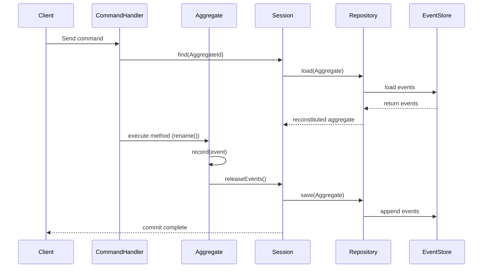

# 🧠 Pillar

[](https://app.codecov.io/gh/edvin/pillar)

### Elegant Domain-Driven Design & Event Sourcing for Laravel

**Pillar** is a modern, pragmatic framework for building **rich domain models** and **event-sourced systems** in
Laravel — without the complexity.

It brings the power of **Domain-Driven Design (DDD)** and **Event Sourcing** to PHP through expressive abstractions and
seamless Laravel integration.

Pillar provides all the essential building blocks for highly maintainable, auditable, and testable applications — so you
can focus on your domain, without being constrained by rigid conventions or framework-imposed structure.

---

## ✨ Features

- ⚙️ **Aggregate roots and repositories** for event-sourced and non-event-sourced aggregates
- 🧩 **Command and Query Buses** with Laravel facade support
- 🧠 **Aggregate sessions** act as a Unit of Work, tracking loaded aggregates and automatically persisting their changes
  and emitted events.
- 🧰 **Pillar facade** for quick access to **session** / **command dispatch** / **query dispatch** etc
- 🗃️ **Event store abstraction** with optimistic concurrency locking
- 🔁 **Event replay** command for rebuilding projections
- 🧬 **Event Upcasters** for schema evolution and backward compatibility
- 💾 **Snapshotting** (opt‑in via `Snapshottable`) with configurable store & pluggable policies
- 🪶 **Serializer abstraction** (default: JSON)
- 🔧 **Laravel integration** via `PillarServiceProvider`
- ⚙️ Configurable **repository** and **event store** implementations

---

## 🧩 Installation

```bash
composer require pillar/pillar
```

Pillar automatically registers its service provider via Laravel package discovery.

Run the installer to set up migrations and configuration:

```bash
php artisan pillar:install
```

This is an interactive installer that asks whether to publish the migrations and config file.

You’ll be prompted to:

- Publish the **events table migration** (for event sourcing)
- Publish the **aggregate_versions table migration** (for per-aggregate versioning)
- Publish the **configuration file** (`config/pillar.php`)

Once published, run:

```bash
php artisan migrate
```

to create the `events` and `aggregate_versions` tables in your database.

---

### 📁 Published files

| File                                                                        | Description                                                                                   |
|-----------------------------------------------------------------------------|-----------------------------------------------------------------------------------------------|
| `database/migrations/YYYY_MM_DD_HHMMSS_create_events_table.php`             | The table used to store domain events                                                         |
| `database/migrations/YYYY_MM_DD_HHMMSS_create_aggregate_versions_table.php` | Counter table tracking the last per-aggregate version for optimistic concurrency & sequencing |
| `config/pillar.php`                                                         | Global configuration for repositories, event store, serializer and snapshotting               |

---

## 🧠 Aggregate Sessions

Command handlers use the **AggregateSession** to load and persist aggregates.

The session tracks all loaded aggregates, captures emitted events, and commits them atomically at the end of the
command.

```php
use Pillar\Aggregate\AggregateSession;
use Context\Document\Domain\Identifier\DocumentId;
use Context\Document\Application\Command\RenameDocumentCommand;

final class RenameDocumentHandler
{
    public function __construct(private AggregateSession $session) {}

    public function __invoke(RenameDocumentCommand $command): void
    {
        $document = $this->session->find(DocumentId::from($command->id));
        $document->rename($command->newTitle);
        $this->session->commit();
    }
}
```

This pattern ensures that all domain changes occur within a controlled *unit of work* —
capturing emitted events, maintaining consistency, and persisting all changes in a single transaction.

## 🧰 Pillar Facade

Prefer dependency injection for core domain code, but the `Pillar` facade is a handy convenience in application code,
console commands, and tests.

**Methods**

- `Pillar::session(): AggregateSession` — get a fresh unit-of-work session
- `Pillar::dispatch(object $command): void` — forward to the Command Bus
- `Pillar::ask(object $query): mixed` — forward to the Query Bus

**Example**

```php
use Pillar\Facade\Pillar;

$session = Pillar::session();

// Dispatch a command
Pillar::dispatch(new CreateDocumentCommand($id, $title, $authorId));

// Ask a query
$document = Pillar::ask(new FindDocumentQuery($id));
```

---

# 🗃️ Event Store

Pillar’s event store is a **pluggable abstraction** that supports streaming domain events efficiently using PHP
generators.  
The default implementation, `DatabaseEventStore`, persists domain events in a database table — but you can replace it
with any other backend such as Kafka, DynamoDB, or S3.

## Interface

```php
interface EventStore
{
    /**
     * Append an event and return the assigned per-aggregate version (aggregate_sequence).
     * If $expectedSequence is provided, the append only succeeds when the current
     * per-aggregate version matches; otherwise a ConcurrencyException is thrown.
     */
    public function append(AggregateRootId $id, object $event, ?int $expectedSequence = null): int;

    /** @return Generator<StoredEvent> */
    public function load(AggregateRootId $id, int $afterAggregateSequence = 0): Generator;

    /** @return Generator<StoredEvent> */
    public function all(?AggregateRootId $aggregateId = null, ?string $eventType = null): Generator;
}
```

Instead of returning arrays, `load()` and `all()` now yield `StoredEvent` instances as generators — allowing **true
streaming** of large event streams with minimal memory usage.

**Optimistic concurrency:** This is handled for you by the AggregateSession. Can be disabled with the config setting
`pillar.event_store.options.optimistic_locking` (default: true). Implementors: EventStore::append() accepts an optional
`$expectedSequence`; if the per-aggregate version has advanced, it must throw a ConcurrencyException.

---

### ⚙️ Fetch Strategies

To handle different data access patterns, Pillar introduces **Event Fetch Strategies**.  
These determine *how* events are read from storage, allowing you to balance performance, memory use, and scalability.

Built-in strategies include:

| Strategy       | Class                          | Description                                                                   |
|----------------|--------------------------------|-------------------------------------------------------------------------------|
| `db_load_all`  | `DatabaseLoadAllStrategy`      | Loads all events into memory — simple but less efficient for large streams.   |
| `db_chunked`   | `DatabaseChunkedFetchStrategy` | Loads events in configurable chunks (default: 1000) for balanced performance. |
| `db_streaming` | `DatabaseCursorFetchStrategy`  | Uses a database cursor to stream events continuously without buffering.       |

You can create your own fetch strategies by implementing the `EventFetchStrategy` interface:

```php
interface EventFetchStrategy
{
    /**
     * Load events for a specific aggregate root.
     *
     * @param AggregateRootId $id
     * @param int $afterAggregateSequence
     * @return Generator<StoredEvent>
     */
    public function load(AggregateRootId $id, int $afterAggregateSequence = 0): Generator;

    /**
     * Load all events across all aggregates, optionally filtered.
     *
     * @param AggregateRootId|null $aggregateId
     * @param string|null $eventType
     * @return Generator<StoredEvent>
     */
    public function all(?AggregateRootId $aggregateId = null, ?string $eventType = null): Generator;
}
```

These methods are **generator-based**, which means strategies can stream data directly from the backend without
buffering all events in memory.

---

### 🧩 Strategy Resolution

Pillar uses the `EventFetchStrategyResolver` to determine which fetch strategy to use at runtime.

You can configure defaults and per-aggregate overrides in `config/pillar.php`:

```php
'fetch_strategies' => [
    'default' => 'db_chunked',

    'overrides' => [
        // Context\LargeAggregate\Domain\Aggregate\BigOne::class => 'db_streaming',
    ],

    'available' => [
        'db_load_all' => [
            'class' => \Pillar\Event\Fetch\Database\DatabaseLoadAllStrategy::class,
            'options' => [],
        ],
        'db_chunked' => [
            'class' => \Pillar\Event\Fetch\Database\DatabaseChunkedFetchStrategy::class,
            'options' => ['chunk_size' => 1000],
        ],
        'db_streaming' => [
            'class' => \Pillar\Event\Fetch\Database\DatabaseCursorFetchStrategy::class,
            'options' => [],
        ],
    ],
],
```

Developers can override the strategy **per aggregate** or even decide dynamically at runtime based on aggregate type,
size, or workload.

---

### ✅ Benefits

- ⚡ **Stream large aggregates** without blowing up memory
- 🧠 **Fine-grained control** over loading behavior per aggregate
- 🧩 **Composable strategies** — easy to plug in new backends
- 🔒 **Type-safe & predictable** event iteration via generators

---

### 🧩 Stream Resolvers

Pillar introduces the **Stream Resolver** abstraction to provide fine-grained control over how event streams are
identified, partitioned, and loaded — especially in advanced scenarios such as multi-tenancy, sharding, or custom stream
partitioning.

A **Stream Resolver** is responsible for mapping an aggregate root ID (or other context) to a logical event stream,
which the event store then uses to read or append events. This enables custom strategies for segmenting event data
beyond the default one-table-per-application model.

#### `DatabaseStreamResolver`

The default resolver supports simple to advanced routing without custom code:

- **Global default**: send everything to a single stream/table (e.g. `events`).
- **Per aggregate type**: map specific classes to their own stream/table.
- **Per aggregate instance**: optionally create a unique stream per ID.
    - Formats:
        - `default_id` → `{default}_{aggregateId}` (e.g., `events_123`)
        - `type_id` → `{AggregateClassBaseName}_{aggregateId}` (e.g., `document_123`).
- **Precedence**: per-type mapping takes priority over per-ID naming.
- **Null ID**: when no ID is provided, the default stream is used.

Example configuration:

```php
'stream_resolver' => [
    'class' => \Pillar\Event\Stream\DatabaseStreamResolver::class,
    'options' => [
        'default' => 'events',
        'per_aggregate_type' => [
            \Context\Document\Domain\Aggregate\Document::class => 'document_events',
        ],
        'per_aggregate_id' => true,
        'per_aggregate_id_format' => 'type_id', // or 'default_id'
    ],
],
```

> If you use a database-backed store, make sure any custom stream/table names actually exist.

#### Roll your own resolver

Implement `Pillar\Event\Stream\StreamResolver` and return your stream name from `resolve()`, then register your
class in `config/pillar.php` under `'stream_resolver'`. This lets you route by tenant, shard, metadata, or anything else
with a few lines of code.

#### Interface

```php
interface StreamResolver
{
    /**
     * Resolve the stream name/identifier for a given aggregate root ID.
     * If the ID is null, the default stream should be returned.
     */
    public function resolve(?AggregateRootId $id): string;
}
```

The aggregate class can be resolved from the AggregateRootId using the `aggregateClass()` method.

---

## ⚡ Ephemeral Events

Not every domain event needs to be stored permanently.  
Some events represent **transient domain signals** — things that should be dispatched in real time but never recorded in
the event store. For these cases, Pillar provides the `EphemeralEvent` marker interface:

```php
use Pillar\Event\EphemeralEvent;

final class TemporaryCacheInvalidated implements EphemeralEvent
{
    public function __construct(
        public string $cacheKey
    ) {}
}
```

Any event implementing `EphemeralEvent` will be **dispatched normally** (to listeners, handlers, and projectors)  
but **excluded from persistence** in the event store. This is useful for:

- Events that only trigger external processes (like cache invalidation or notifications)
- Integration events that are transient and not part of aggregate history
- Temporary or internal system events that don’t represent durable business facts

This keeps your event streams clean, containing only domain events that truly represent **state changes**.

## 🧩 Context Registries

A **ContextRegistry** acts as a central place to register and organize the commands, queries, and events belonging to a
bounded context. It helps structure your application by grouping related domain logic and event handling in one place.

A ContextRegistry typically defines:

- The **name** of the context
- The **commands** handled within the context
- The **queries** supported by the context
- The **events** produced, along with their listeners and optional aliases

This registration enables Pillar to automatically wire up command and query buses, event dispatching, and alias
management across your application.

### Example ContextRegistry

```php
use Pillar\Context\ContextRegistry;
use Pillar\Context\EventMapBuilder;

final class DocumentContextRegistry implements ContextRegistry
{
    public function name(): string
    {
        return 'document';
    }

    public function commands(): array
    {
        return [
            CreateDocumentCommand::class,
            RenameDocumentCommand::class,
        ];
    }

    public function queries(): array
    {
        return [
            FindDocumentQuery::class,
        ];
    }

    public function events(): EventMapBuilder
    {
        return EventMapBuilder::create()
            ->event(DocumentCreated::class)
                ->alias('document_created')
                ->upcasters([DocumentCreatedV1ToV2Upcaster::class])
                ->listeners([DocumentCreatedProjector::class])
            ->event(DocumentRenamed::class)
                ->alias('document_renamed')
                ->listeners([DocumentRenamedProjector::class]);
    }
}
```

🧰 Registering Context Registries

Each ContextRegistry must be registered in your application’s `config/pillar.php` file under the Each ContextRegistry
must be registered in your application’s `config/pillar.php` file under the `context_registries` key:

```php
'context_registries' => [
    \Context\DocumentHandling\Application\DocumentContextRegistry::class,
    \Context\UserManagement\Application\UserContextRegistry::class,
],
```

---

## 🎭 Event Aliases

Pillar supports mapping **event classes to short aliases** to make stored event names more readable and stable over
time.

Event aliases are defined in your `ContextRegistry` using the `EventMapBuilder`.  
This allows each bounded context to declare its own aliases alongside its event listeners:

```php
public function events(): EventMapBuilder
{
    return EventMapBuilder::create()
        ->event(DocumentCreated::class)
            ->alias('document_created')
            ->listeners([DocumentCreatedProjector::class])
        ->event(DocumentRevised::class)
            ->alias('document_revised')
            ->listeners([DocumentRevisedProjector::class]);
}
```

During serialization, the alias will be stored in the event store instead of the full class name.  
When loading events, both the alias **and** the original class name are supported — ensuring **backward compatibility**
with existing event streams.

Event aliases are automatically registered through the `ContextRegistry` during application boot,  
and managed globally by the `EventAliasRegistry`, which is used internally by the `DatabaseEventStore`.

### ✅ Benefits

- Shorter, human-readable event names in your database
- Backward compatibility for renamed or refactored event classes
- Centralized alias management across contexts

---

### ⚠️ Avoiding Alias Collisions

Aliases must be **globally unique** because all events share a single alias registry. If two different events (even from
different bounded contexts) use the same alias, it can cause deserialization of the wrong event type, leading to subtle
and hard-to-debug errors.

To prevent collisions, always **prefix your aliases with your context name** or another unique namespace. For example:

- `document.created`
- `billing.invoice_issued`
- `user.password_reset`

This namespacing convention ensures that even if multiple contexts define events with similar names (like `created`),
their aliases remain distinct and unambiguous.

Using fully qualified, namespaced aliases helps maintain the integrity and readability of your event store across all
bounded contexts.

---

## 🧬 Event Upcasters

**Upcasters** allow you to evolve event schemas over time while keeping your historical event data valid.  
They transform old event payloads into their latest structure during deserialization — before your aggregates or
projectors ever see them.

This makes it safe to refactor your events or add new fields without rewriting your event store.

### Example

```php
use Pillar\Event\Upcaster;

final class DocumentCreatedV1ToV2Upcaster implements Upcaster
{
    public static function eventClass(): string
    {
        return DocumentCreated::class;
    }

    public static function fromVersion(): int
    {
        return 1; // upgrades v1 -> v2
    }

    public function upcast(array $payload): array
    {
        // Older events lacked a "created_by" field — set a default.
        $payload['created_by'] ??= 'system';
        return $payload;
    }
}
```

### Registration

Each upcaster is registered in its `ContextRegistry` using the `EventMapBuilder`:

```php
public function events(): EventMapBuilder
{
    return EventMapBuilder::create()
        ->event(DocumentCreated::class)
            ->alias('document_created')
            ->listeners([DocumentCreatedProjector::class])
            ->upcasters([DocumentCreatedV1ToV2Upcaster::class]);
}
```

### How It Works

- Upcasters are registered globally in the **UpcasterRegistry** during application boot via the `ContextLoader`.
- When events are loaded from the event store, Pillar checks the stored event version and the current version declared
  by the event (see “Versioned Events” below).
- If the stored version is lower, Pillar applies upcasters sequentially (v1 → v2 → v3 → …) until the payload matches the
  current version.
- Each upcaster declares the event class it handles and the version it upgrades from via `fromVersion()`.

---

### ✅ Benefits

- Seamless **schema evolution** for persisted events
- Fully **backward compatible** without modifying existing data
- **Composable transformations** — multiple upcasters can chain together
- Zero impact on aggregate or projector code

---

### ⚡ Optimized Serialization

Pillar’s default `JsonObjectSerializer` automatically converts objects to and from JSON,
using PHP reflection to reconstruct event and command objects during deserialization.

To ensure high performance, **constructor parameter metadata is cached per class**.
This avoids repeated reflection calls on hot paths, making event and command deserialization
fast even at large scales.

You can provide your own serializer by implementing the `ObjectSerializer` interface —
for example, to integrate a binary format or custom encoding strategy.

---

### 🧩 Versioned Events

Pillar supports **versioned domain events** to make schema evolution explicit and safe.

Implement `VersionedEvent` on your event and declare its current schema version:

```php
use Pillar\Event\VersionedEvent;

final class DocumentCreated implements VersionedEvent
{
    public static function version(): int
    {
        return 2;
    }

    public function __construct(
        public string $title,
        public string $created_by
    ) {}
}
```

- The event’s version is stored in the event store (`event_version` column) alongside its payload.
- On load, if a stored event has an **older version**, Pillar applies registered upcasters step-by-step until the
  payload reaches the event’s current version.
- You can register **multiple upcasters** for the same event (e.g. v1→v2, v2→v3). They are applied in ascending order of
  `fromVersion()`.

**Tip:** If you refactor an event without changing its shape, you can simply bump the version and register a no-op
upcaster for documentation clarity.

---

## 🧩 Aggregate Roots

Aggregates are the **core building blocks** of your domain model — they encapsulate state and enforce invariants through
event-driven or state-driven updates.

In Pillar, all aggregates extend the abstract base class `AggregateRoot`, which provides a consistent pattern for *
*recording and applying domain events**, while still allowing simpler state-backed persistence when full event sourcing
isn’t needed.

---

### Example (Event-Sourced Aggregate)

```php
use Pillar\Aggregate\AggregateRoot;
use Pillar\Snapshot\Snapshottable;
use Context\Document\Domain\Event\DocumentCreated;
use Context\Document\Domain\Event\DocumentRenamed;
use Context\Document\Domain\Identifier\DocumentId;

final class Document extends AggregateRoot implements Snapshottable
{
    private DocumentId $id;
    private string $title;

    public static function create(DocumentId $id, string $title): self
    {
        $self = new self();
        $self->record(new DocumentCreated($id, $title));
        return $self;
    }

    public function rename(string $newTitle): void
    {
        if ($this->title === $newTitle) {
            return;
        }

        $this->record(new DocumentRenamed($this->id(), $newTitle));
    }

    protected function applyDocumentCreated(DocumentCreated $event): void
    {
        $this->id = $event->id;
        $this->title = $event->title;
    }

    protected function applyDocumentRenamed(DocumentRenamed $event): void
    {
        $this->title = $event->newTitle;
    }

    // Snapshottable
    public function toSnapshot(): array
    {
        return [
            'id' => (string) $this->id,
            'title' => $this->title,
        ];
    }

    public static function fromSnapshot(array $data): static
    {
        $self = new self();
        $self->id = DocumentId::from($data['id']);
        $self->title = $data['title'];
        return $self;
    }

    public function id(): DocumentId
    {
        return $this->id;
    }
}
```

This is the **event-sourced** approach — every state change is expressed as a **domain event**, persisted to the event
store, and used to rebuild the aggregate’s state later.

This model gives you:

- 🔍 **Full auditability** of all domain changes over time
- 🕰️ **Reproducibility** and replay capability
- ⚙️ **Resilience** against schema evolution with versioned events and upcasters

---

### Example (State-Based Aggregate)

For simpler domains, you can skip event sourcing entirely.
In that case, your repository can directly persist and retrieve aggregates from a storage backend (like Eloquent or a
document store).
You don’t record or apply events — you just mutate the state directly.

```php
use Context\Document\Domain\Identifier\DocumentId;
use Pillar\Aggregate\AggregateRoot;
use Pillar\Snapshot\Snapshottable;

final class Document extends AggregateRoot implements Snapshottable
{
    public function __construct(
        private DocumentId $id,
        private string $title
    ) {}

    public function rename(string $newTitle): void
    {
        $this->title = $newTitle;
    }

    // Snapshottable
    public function toSnapshot(): array
    {
        return [
            'id' => (string) $this->id,
            'title' => $this->title,
        ];
    }

    public static function fromSnapshot(array $data): static
    {
        return new self(DocumentId::from($data['id']), $data['title']);
    }

    public function id(): DocumentId
    {
        return $this->id;
    }
}
```

This **state-based** model is ideal for:

- 🧾 Aggregates that don’t require **audit trails** or **historical replay**
- ⚡ Domains that favor **direct persistence** over event sourcing
- 🧰 Use cases where you want the same aggregate behavior API but backed by a simpler repository

Both models work seamlessly with Pillar’s repository and session abstractions — you can mix and match them in the same
application.

---

### 🧠 Aggregate Lifecycle Overview



*(For state-based aggregates, the “EventStore” step is replaced with a direct database update.)*

---

## 💾 Snapshotting

Snapshotting lets you periodically capture an aggregate’s current state to avoid replaying a long event history on load.

### Opt-in with `Snapshottable`

Aggregates **opt in** to snapshotting by implementing the `Snapshottable` interface and providing two methods:

```php
interface Snapshottable
{
    /** Return a serializable array representing the current state. */
    public function toSnapshot(): array;

    /** Rebuild an aggregate from a previously stored snapshot. */
    public static function fromSnapshot(array $data): static;
}
```

> Aggregates that do **not** implement `Snapshottable` are ignored by the snapshot store.

### Configuration

Configure snapshotting in `config/pillar.php`:

```php
'snapshot' => [
    'store' => [
        'class' => \Pillar\Snapshot\CacheSnapshotStore::class,
    ],
    'ttl' => null, // Time-to-live in seconds (null = indefinitely)

    // Delegating policy selects which policy to use per aggregate
    'policy' => [
        'default' => [
            'class' => \Pillar\Snapshot\AlwaysSnapshotPolicy::class,
        ],
        'overrides' => [
            // \App\Aggregates\BigAggregate::class => [
            //     'class' => \Pillar\Snapshot\CadenceSnapshotPolicy::class,
            //     'options' => ['threshold' => 500, 'offset' => 0],
            // ],
            // \App\Aggregates\Report::class => [
            //     'class' => \Pillar\Snapshot\OnDemandSnapshotPolicy::class,
            // ],
        ],
    ],
],
```

Pillar binds `SnapshotPolicy` to a **delegating policy** that reads this config, instantiates the chosen policy, and
applies any per-aggregate overrides.

### Built-in policies

| Policy        | Class                    | Behavior                                                                 | Options                                                   |
|---------------|--------------------------|--------------------------------------------------------------------------|-----------------------------------------------------------|
| **Always**    | `AlwaysSnapshotPolicy`   | Snapshot automatically whenever the commit persisted one or more events. | _None_                                                    |
| **Cadence**   | `CadenceSnapshotPolicy`  | Snapshot on a cadence: when `(newSeq - offset) % threshold === 0`.       | `threshold` (int, default 100), `offset` (int, default 0) |
| **On-Demand** | `OnDemandSnapshotPolicy` | Never auto-snapshot; call the snapshot store yourself when you decide.   | _None_                                                    |

**Parameters passed to policies**

- `$newSeq` — last persisted aggregate version *after* the commit
- `$prevSeq` — aggregate version at load time (0 if new)
- `$delta` — number of events persisted in this commit (`$newSeq - $prevSeq`)

### Manual snapshots (On-Demand)

When using `OnDemandSnapshotPolicy`, Pillar won't auto-snapshot.

**Tip:** You can take a snapshot at any **arbitrary point**, regardless of which `SnapshotPolicy` is configured —
calling `SnapshotStore::save(...)` bypasses the policy (the store will still no‑op for aggregates that don’t implement
`Snapshottable`). If you need the current persisted version, load the aggregate via its repository:

```php
use Pillar\Repository\RepositoryResolver;
use Pillar\Snapshot\SnapshotStore;

$loaded = app(RepositoryResolver::class)->forId($id)->find($id);
if ($loaded) {
    app(SnapshotStore::class)->save($loaded->aggregate, $loaded->version);
}
```

### Storage

The default `CacheSnapshotStore` uses Laravel’s cache. Set `ttl` for automatic expiry (seconds), or leave `null` to keep
snapshots indefinitely. For best performance in production, point your cache to Redis or another fast store.

### Custom dynamic policy

You can implement domain-specific logic by writing your own policy:

```php
use Pillar\Snapshot\SnapshotPolicy;
use Pillar\Aggregate\AggregateRoot;

final class BigAggregatePolicy implements SnapshotPolicy
{
    public function __construct(private int $maxDelta = 250) {}

    public function shouldSnapshot(AggregateRoot $aggregate, int $newSeq, int $prevSeq, int $delta): bool
    {
        // Example: snapshot big aggregates frequently, small ones rarely
        if ($aggregate instanceof \App\Aggregates\BigAggregate) {
            return $delta > 0 && $delta >= $this->maxDelta;
        }

        // Fallback cadence every 100 events
        return $delta > 0 && ($newSeq % 100) === 0;
    }
}
```

Register it as the default or as an override in `snapshot.policy`.

---

## 🆔 Aggregate IDs

Aggregate IDs uniquely identify instances of aggregates within your domain. Pillar uses strongly-typed aggregate ID
classes to ensure type safety and clarity.

An aggregate ID is typically a value object implementing or extending `AggregateRootId`. These IDs are used to load,
save, and track aggregates within the event store and repositories through the `aggregateClass()` method.

Example of a simple aggregate ID class:

```php
use Pillar\Aggregate\AggregateRootId;

final readonly class DocumentId extends AggregateRootId
{
    public static function aggregateClass()
    {
        return Document::class;
    }
}
```

Aggregate IDs are used throughout Pillar APIs, including:

- Finding aggregates in an `AggregateSession`
- Appending events to the event store
- Checking aggregate existence in repositories

Using strongly-typed IDs helps prevent mixing different aggregate types and improves code readability.

---

## 🧱 Repositories

Repositories are resolved dynamically via the configuration.

The default repository type is the `EventStoreRepository`, but you can override this per aggregate class:

```php
'repositories' => [
    'default' => Pillar\Repository\EventStoreRepository::class,
    Context\DocumentHandling\Domain\Aggregate\Document::class => Context\DocumentHandling\Infrastructure\Repository\DocumentRepository::class,
],
```

This makes it trivial to store some aggregates in a database and others via event sourcing.

To implement custom persistence for your aggregate, implement the `AggregateRepository` interface and register it here.
The repository returns a `LoadedAggregate` DTO containing the aggregate and metadata so the session can enforce
optimistic concurrency without extra queries.

```php
final class LoadedAggregate
{
    public function __construct(
        public readonly AggregateRoot $aggregate,
        public readonly int $version,
    ) {}
}

interface AggregateRepository
{
    public function find(AggregateRootId $id): ?LoadedAggregate;

    public function save(AggregateRoot $aggregate, ?int $expectedVersion = null): void;
}
```

---

## 🧩 Projectors

Projectors are special event listeners that build or update read models and are safe to replay. They implement the new
marker interface `Projector`, and only projectors are invoked during event replay. This separation ensures that replays
do not trigger side effects such as sending emails or other external actions.

Example of a projector implementing the interface:

```php
use Pillar\Event\Projector;

final class DocumentCreatedProjector implements Projector
{
    public function __invoke(DocumentCreated $event): void
    {
        // Update read model, e.g. insert or update a database record
    }
}
```

Example of a listener that is not a projector and will not be invoked during replay:

```php
final class SendDocumentCreatedNotification
{
    public function __invoke(DocumentCreated $event): void
    {
        // Send email notification, side effect not safe for replay
    }
}
```

### ⚠️ Projector Safety & Idempotency

Projectors must be **pure and idempotent**.  
They are re-invoked during event replays to rebuild read models, so applying the same event multiple times should never
produce different results or duplicate data.

For example, when updating a database, projectors should use *insert-or-update* logic instead of blindly inserting new
records.

⚠️ **Important:** Listeners that perform side effects (such as sending emails, publishing messages, or calling APIs)
must **not** implement `Projector`, since replays would re-trigger those side effects. Projectors should handle only
deterministic, replay-safe updates to read models.

---

## 🔁 Event Replay Command

Replays stored domain events to rebuild projections. Only listeners implementing `Projector` are invoked during replay (
no side‑effects).

### Usage

```bash
php artisan pillar:replay-events
php artisan pillar:replay-events {aggregate_id}
php artisan pillar:replay-events {aggregate_id} {event_type}
php artisan pillar:replay-events null {event_type}
```

### Filters

Constrain by **global sequence** and/or **occurred_at (UTC)**:

```bash
# Sequence window (inclusive)
php artisan pillar:replay-events --from-seq=1000 --to-seq=2000

# Date window (inclusive, UTC). ISO-8601 or anything Carbon parses.
php artisan pillar:replay-events --from-date="2025-01-01T00:00:00Z" --to-date="2025-01-31T23:59:59Z"

# Combine with aggregate and event type
php artisan pillar:replay-events 3f2ca9d8-4e0b-4d1b-a1d5-4c1b9f0f1f2e \
    App\\Events\\DocumentRenamed \
    --from-date="2025-01-01" --to-seq=50000
```

**Notes**

- Bounds are **inclusive**.
- Dates are parsed and compared in **UTC** against each event’s `occurred_at`.
- The `--to-seq` upper bound short‑circuits early since the `all()` stream is ordered by global `sequence`.
- Pass `null` as the first positional argument to mean “all aggregates”.

## 🧾 License

MIT © Edvin Syse
