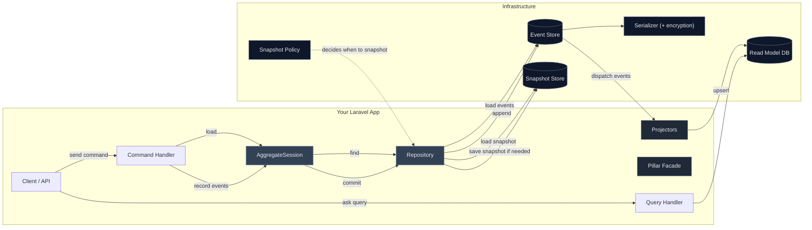

# 🧱 Architecture Overview

The big picture of how Pillar pieces fit together — including snapshots, streaming fetch strategies, and the `EventWindow` time/position bounds.

---

## Key ideas

- **AggregateSession & Repository**  
  Your handler calls the session to `find(...)` an aggregate. The repository loads an optional snapshot and then streams events from the **Event Store** to rebuild state.  
  Repositories now resolve stream identifiers through the AggregateRegistry; no separate Stream Resolver exists.

- **Streaming reads (fetch strategies)**  
  `load()` yields events as generators (chunked, cursor-based, or load‑all), letting you process large streams with minimal memory.

- **EventWindow — load “as of” a point in time**  
  All aggregate loads can be bounded using an optional `EventWindow`:
  - `afterStreamSequence`: start strictly *after* this stream_sequence (the repository sets this to the snapshot version automatically).
  - `toStreamSequence`: stop at a stream_sequence.
  - `toGlobalSequence`: stop at a specific global sequence.
  - `toDateUtc`: stop at a timestamp (UTC).
  
  This enables “show state at event X / at time T” without special APIs.  
  Stream IDs are readable tags such as 'document-<uuid>' generated by AggregateRegistry.

- **Snapshots (optional, policy‑driven)**  
  After a commit, the snapshot **policy** decides if the repository should persist a new snapshot to the **Snapshot Store** (cache or your own implementation).

- **Serializer (+ optional payload encryption)**  
  The base serializer (JSON by default) can be wrapped by an **encrypting** serializer with a pluggable cipher. Encryption can be enabled globally and overridden per event type.

- **Projectors & read models**  
  Stored events are dispatched to projectors to build queryable read models (in your DB of choice).  

- **Replays**  
  `pillar:replay-events` replays events to projectors (only), scoped by aggregate, type, or time/sequence windows.

---

## See also

- [Aggregate sessions](/concepts/aggregate-sessions)
- [Aggregate roots](/concepts/aggregate-roots)
- [Snapshotting](/concepts/snapshotting)
- [Event Store](/event-store/)
- [Serialization → Payload encryption](/concepts/serialization#payload-encryption)
- [CLI — Replay events](/reference/cli-replay)
