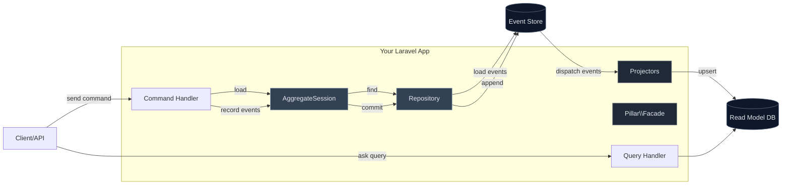

# 🧱 Architecture Overview

The big picture of how Pillar pieces fit together.

See also:
- [/concepts/aggregate-sessions](/concepts/aggregate-sessions)
- [/event-store/](/event-store/)
- [/concepts/projectors](/concepts/projectors)
