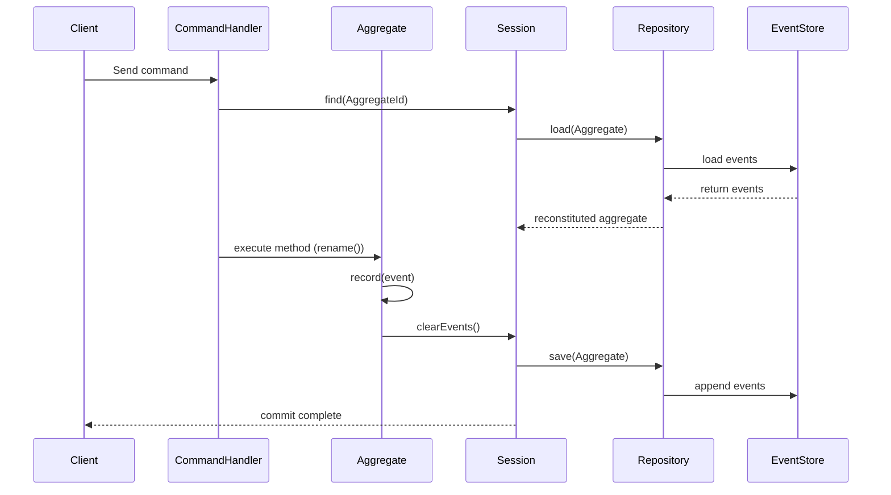

## 🧩 Aggregate Roots

Aggregates are the **core building blocks** of your domain model — they encapsulate state and enforce invariants through
event-driven or state-driven updates.

In Pillar, all aggregates implement the interface `AggregateRoot`. If your aggregate is using event sourcing, instead
implement the `EventSourcedAggregateRoot` interface and use the trait `RecordsEvents`, which provides a consistent pattern for **recording and applying [domain events](/concepts/events)**.

---

### Example (Event-Sourced Aggregate)

```php
use Pillar\Aggregate\EventSourcedAggregateRoot;
use Context\Document\Domain\Event\DocumentCreated;
use Context\Document\Domain\Event\DocumentRenamed;
use Context\Document\Domain\Identifier\DocumentId;

final class Document implements EventSourcedAggregateRoot
{
    use RecordsEvents;
    
    private DocumentId $id;
    private string $title;

    public static function create(DocumentId $id, string $title): self
    {
        $self = new self();
        $self->record(new DocumentCreated($id, $title));
        return $self;
    }

    public function rename(string $newTitle): void
    {
        if ($this->title === $newTitle) {
            return;
        }

        $this->record(new DocumentRenamed($this->id(), $newTitle));
    }

    protected function applyDocumentCreated(DocumentCreated $event): void
    {
        $this->id = $event->id;
        $this->title = $event->title;
    }

    protected function applyDocumentRenamed(DocumentRenamed $event): void
    {
        $this->title = $event->newTitle;
    }

    public function id(): DocumentId
    {
        return $this->id;
    }
}
```

This is the **event-sourced** approach — every state change is expressed as a **[domain event](/concepts/events)**,
persisted to the [event store](/event-store), and used to rebuild the aggregate’s state later.

This model gives you:

- 🔍 **Full auditability** of all domain changes over time
- 🕰️ **Reproducibility** and replay capability
- ⚙️ **Resilience** against schema evolution with [versioned events](/concepts/versioned-events) and [upcasters](/concepts/event-upcasters)

---

### Example (State-Based Aggregate)

For simpler domains, you can skip event sourcing entirely.
In that case, your repository can directly persist and retrieve aggregates from a storage backend (like Eloquent or a
document store).
You don’t record or apply events — you just mutate the state directly.

```php
use Context\Document\Domain\Identifier\DocumentId;
use Pillar\Aggregate\AggregateRoot;

final class Document implements AggregateRoot
{
    public function __construct(
        private DocumentId $id,
        private string $title
    ) {}

    public function rename(string $newTitle): void
    {
        $this->title = $newTitle;
    }

    public function title(): string
    {
        return $this->title;
    }

    public function id(): DocumentId
    {
        return $this->id;
    }
}
```

This **state-based** model is ideal for:

- 🧾 Aggregates that don’t require **audit trails** or **historical replay**
- ⚡ Domains that favor **direct persistence** over event sourcing
- 🧰 Use cases where you want the same aggregate behavior API but backed by a simpler repository

Both models work seamlessly with Pillar’s [repository](/concepts/repositories) and [session](/concepts/aggregate-sessions) abstractions — you can mix and match them in the same application.

#### Wiring a state‑based aggregate with Eloquent

For state‑based aggregates, the [repository](/concepts/repositories) persists fields directly (no events). Here’s a minimal Eloquent mapping:

```php
// app/Models/DocumentRecord.php
namespace App\Models;

use Illuminate\Database\Eloquent\Model;

class DocumentRecord extends Model
{
    protected $table = 'documents';
    public $timestamps = false;
    protected $fillable = ['id', 'title'];
}
```

#### Migration (documents table)

```php
// database/migrations/XXXX_XX_XX_000000_create_documents_table.php
use Illuminate\Database\Migrations\Migration;
use Illuminate\Database\Schema\Blueprint;
use Illuminate\Support\Facades\Schema;

return new class extends Migration {
    public function up(): void {
        Schema::create('documents', function (Blueprint $table) {
            $table->uuid('id')->primary();
            $table->string('title');
        });
    }

    public function down(): void {
        Schema::dropIfExists('documents');
    }
};
```

```php
// app/Context/Document/Infrastructure/DocumentRepository.php
namespace App\Context\Document\Infrastructure;

use Pillar\Repository\AggregateRepository;
use Pillar\Repository\LoadedAggregate;
use Pillar\Aggregate\AggregateRootId;
use Pillar\Aggregate\AggregateRoot;
use App\Models\DocumentRecord;
use Context\Document\Domain\Aggregate\Document;   // your aggregate class
use Context\Document\Domain\Identifier\DocumentId;

final class DocumentRepository implements AggregateRepository
{
    public function find(AggregateRootId $id): ?LoadedAggregate
    {
        $row = DocumentRecord::query()->whereKey((string) $id)->first();
        if (!$row) {
            return null;
        }

        $aggregate = new Document(DocumentId::from($row->id), $row->title);

        return new LoadedAggregate($aggregate);
    }

    public function save(AggregateRoot $aggregate, ?int $expectedVersion = null): void
    {
        /** @var Document $aggregate */
        $id = (string) $aggregate->id();

        // Upsert without optimistic locking
        $row = DocumentRecord::query()->whereKey($id)->first();
        if ($row) {
            $row->title = $aggregate->title();
            $row->save();
        } else {
            // First write
            DocumentRecord::create([
                'id' => $id,
                'title' => $aggregate->title(),
            ]);
        }
    }
}
```

> **Optional — optimistic locking:** If you want optimistic concurrency for state‑based aggregates, add a `version`
> column and fetch the row with `DocumentRecord::query()->whereKey($id)->lockForUpdate()->first()`, verify the current
`version` matches the expected value, then bump it on update. This mirrors the [event store](/event-store)’s concurrency check.

Register the repository for this aggregate in `config/pillar.php`:

```php
'repositories' => [
    'default' => Pillar\Repository\EventStoreRepository::class,
    Context\Document\Domain\Aggregate\Document::class => App\Context\Document\Infrastructure\DocumentRepository::class,
],
```

Now a command handler can load and save via the [**AggregateSession**](/concepts/aggregate-sessions) (no [event store](/event-store) involved):

```php
$doc = $session->find(DocumentId::from($id));
$doc->rename('New Title');
$session->commit(); // persists through DocumentRepository
```

---

### 🧠 Aggregate Lifecycle Overview



*(For state-based aggregates, the “EventStore” step is replaced with a direct database update.)*


